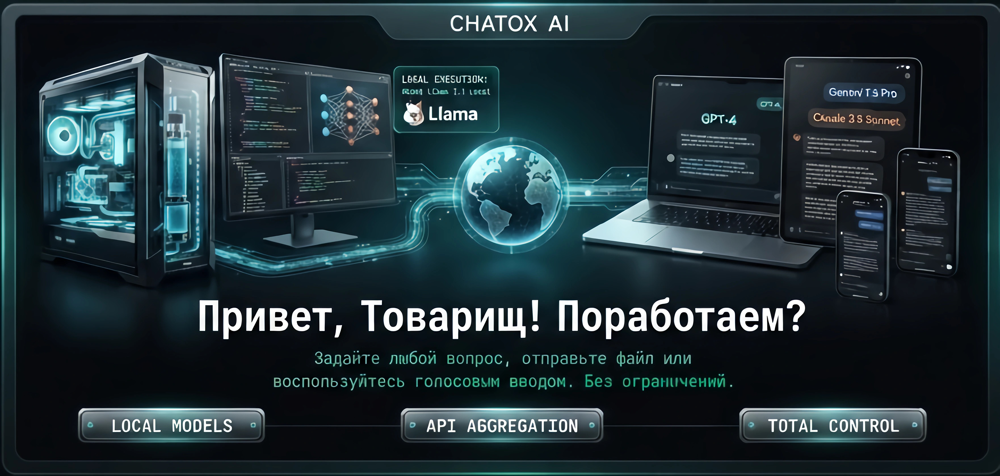

# ⚡ CHATOX AI
# MADE BY AI



> **CHATOX AI** — Универсальный, приватный и стильный ИИ-клиент для Android и Windows (ПК) с поддержкой всех популярных нейросетей, локальных портов Ollama/LM Studio и сквозного шифрования.

---

## 📥 Скачать приложение (Релизы)

Перейдите во вкладку [**Releases**](https://github.com/Mega-Shmel/CHATOX-AI/releases) для загрузки актуальной версии:

- 📱 **Android (.apk)**: `app-debug.apk` / `CHATOX-AI-v*.*.*.apk`
- 💻 **Windows Installer (.exe)**: `CHATOX AI Setup *.*.*.exe`
- 💻 **Windows Portable (.exe)**: `CHATOX AI *.*.* Portable.exe`

---

## 🌟 Основные возможности

- 🤖 **Все передовые модели**: Gemini 3.7/Flash, GPT-4o, Claude 3.5, Grok 3, DeepSeek R1/V3, Llama 3.3, Mistral, Qwen 2.5 и другие.
- 🔌 **Локальный ИИ без интернета**: Подключение к Ollama, LM Studio, vLLM по локальным портам (`11434`, `1234`, `8000`).
- 🔒 **Максимальная приватность**: Сквозное шифрование AES-256-GCM, защита данных при переносе устройства и локальное хранение.
- 🎨 **Киберпанк & Неоновый стиль**: Выбор тем, кастомных цветов акцента, системных промптов и индивидуальных настроек каждой модели (⚙️).
- 🎙️ **Мультимодальность**: Поддержка файлов (текст, изображения, код), распознавание речи (голосовой ввод) и озвучивание ответов.

---

## 🚀 Сборка проекта

### Android
```bash
npm install
npm run build
npx cap sync android
cd android && ./gradlew assembleDebug
```

### Windows (ПК)
```bash
npm install
npm run build
npx electron-builder --win
```
